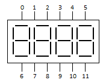

# SMA420564

Python3 & Shell Bindings for 12 pin 7 segment 4 digit display with the Raspberry PI.

<br/><br/>


## Hardware Setup

SMA420564 Display pins:



<br/><br/>

Connect pins to the rPI:
```
SMA420564        Raspberry PI
  0  --- to ----> GPIO4
  1  --- to ----> GPIO17
  2  --- to ----> GPIO27
  3  --- to ----> GPIO22
  4  --- to ----> GPIO18
  5  --- to ----> GPIO23
  6  --- to ----> GPIO24
  7  --- to ----> GPIO25
  9  --- to ----> GPIO10
  10 --- to ----> GPIO9
  11 --- to ----> GPIO11
```
Wants to change the pin configuration? Modify `config/pinConfig.txt` with this syntax `GPIOPIN:DisplayPin`.

<br/><br/>

## Software Setup


<br/>

Enable Raspberry PI's GPIO pins:
```sh
sudo usermod -a -G gpio your_username
```


<br/>


Setup shell aliases & install requirements: <br/>
```sh
# SMA420564/
source setup.sh
```
Aliases set to path `/home/pi/SMA420564/src/`. <br/>
Modify `setup.sh` to set your own install path.


<br/><br/>

## Usage

<br/>

Write text on lcd screen:

```
display [4 digit value] [Time in seconds]
```


<br/><br/>

## Usage (No alias)

<br/>

Write text on lcd screen:

```
sudo python3 disp.py [4 digit value] [Time in seconds]
```

<br/><br/>
